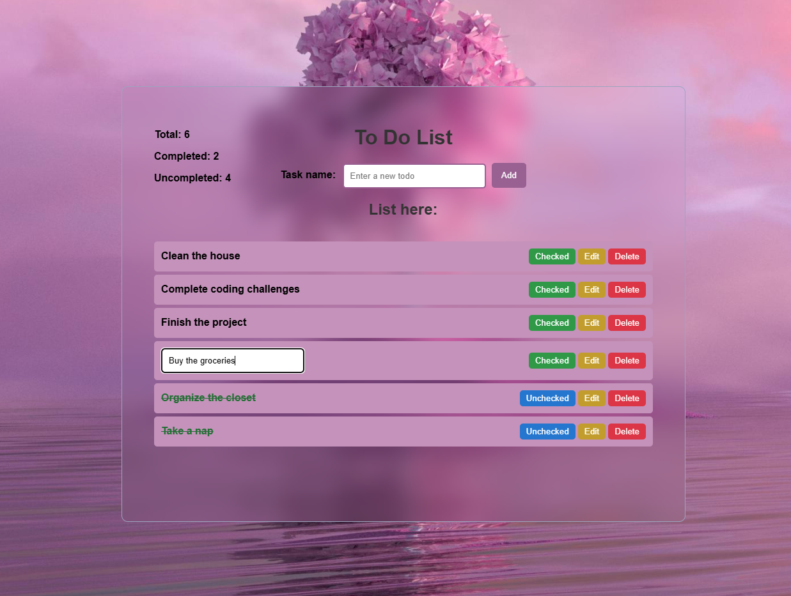

# Todo App ✨📝

This project is a simple Todo List application built using **HTML**, **CSS**, and **JavaScript**. It was developed as part of the **SDA Bootcamp** 🏫💻 to help build foundational skills in web development. The app allows users to efficiently manage their tasks by adding, editing, deleting, and tracking the completion status of their to-dos.


## Features 🎯

The application includes the following features:

**1. Adding a Todo:** input field & button to add the typed task to the list.

**2. Rendering Todo List:** Displays a list of todos, each with a checkbox and task description.

**3. Completing a Todo:** Clicking the checkbox marks the task as complete.

**4. Deleting a Todo:** Delete button next to each task to remove it from the list.

**5. Editing a Todo:** Edit button next to each todo allows users to modify the task description.

**6. Todo Counter:** Counter displaying the total number of todos, number of completed & uncompleted tasks.
  
**7. Todo Counter:** The ability to save todo items in local storage, so they persist even after page refreshes.

## Technologies Used ⚙️

- **HTML** for the structure of the app.
- **CSS** for styling and layout.
- **JavaScript** for functionality and interaction.

### Screenshot 📸
Here’s a preview of how the Todo App looks:




### Installation 🚀

To run this project locally, follow these steps:

1. Clone the repository:

```
  git clone https://github.com/etharalrehaili/todo.git
```

2. Navigate into the project directory:

```
  cd todo
```

3. Open the `index.html` file in your browser.


### Live App 🚀

You can access app here:

[Todo App - Live
](https://main.d25qu4t6ct8vpo.amplifyapp.com/)

